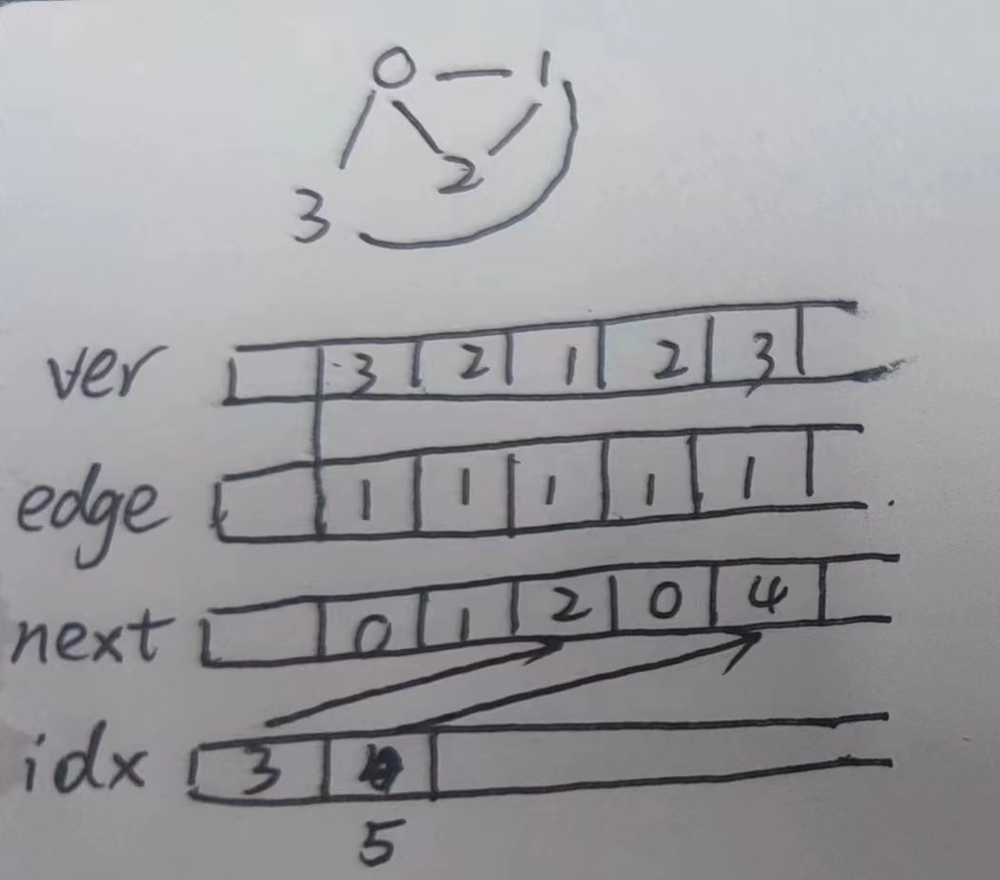

# 图的表示
## 邻接矩阵表示
空间复杂度为$O(n^2)$
## 邻接表表示
使用数组模拟链表的方式来实现：
```cpp
int idx[N], ver[N], edge[N], next[N]; // idx数组用于存储节点i在ver,edge中的位置，相当于指针, next数组模拟链表指针，用于得到下一个链接节点的位置; idx[0] = 0表示空
int edge[N]; //边权
// 添加节点，边
int num = 0;
void add(int x, int y, int val) { // 节点x -> 节点y 有向边，边权为val
    num ++; 
    ver[num] = y;
    edge[num] = val;

    next[num] = idx[x];
    idx[x] = num;
}
```


idx[i]为指针，用于指向i所连的第一条边在数组ver和edge中的位置，然后使用next[i]可以得到下一条边在数组ver和edge中的位置，直到next[i]为0为止，则遍历完节点i为起始点的所有边。
遍历方法如下：
```cpp
for (int i = idx[x]; i ; i = next[i])
{
    int y = ver[i], val = edge[i];
}
```